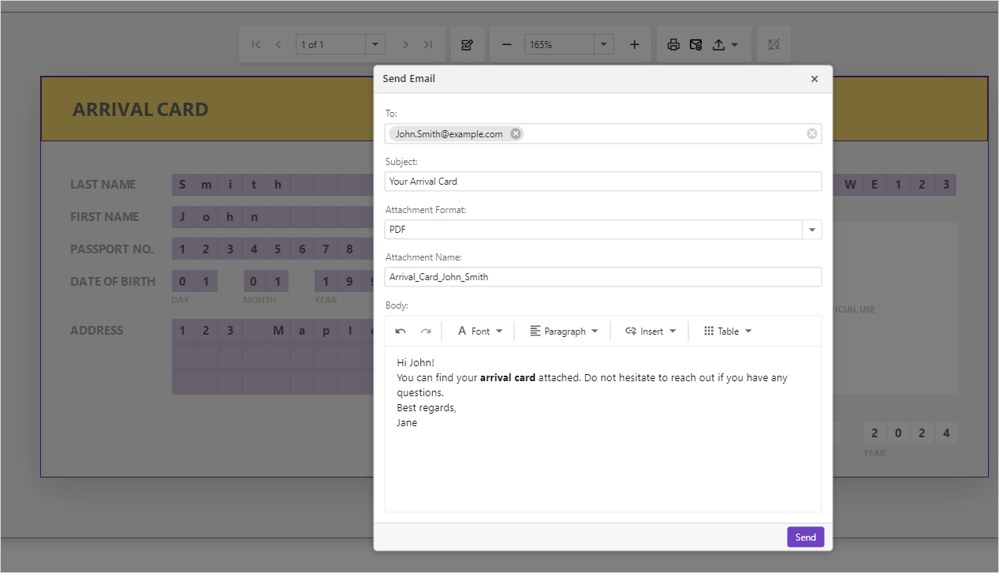

<!-- default badges list -->
[](https://supportcenter.devexpress.com/ticket/details/T1232536)
[](https://docs.devexpress.com/GeneralInformation/403183)
<!-- default badges end -->
# Reporting for Blazor - Email a Report from the Native Blazor Report Viewer

This example uses the [Mailkit](https://mimekit.net/docs/html/Introduction.htm) library to send an email from our Native Blazor Report Viewer.

The **Send Email** button in the Viewer’s toolbar opens the **Send Email** dialog ([DxPopup](https://docs.devexpress.com/Blazor/DevExpress.Blazor.DxPopup)). In the dialog,  you can specify the recipient list, subject, attachment, and body. Click the **Send** button to send the report with the specified settings:



The resulting email may look as follows:


## Implementation Details

### UI Elements

The example handles the [`CustomizeToolbar`](https://docs.devexpress.com/XtraReports/DevExpress.Blazor.Reporting.DxReportViewer.OnCustomizeToolbar) event to add a **Send Email** button to the Viewer's Toolbar. The code snippet below adds locates the **Export To** command and adds the new button next to it:

```cs
void OnCustomizeToolbar(ToolbarModel toolbarModel) {
    toolbarModel.AllItems.Insert(toolbarModel.AllItems.FindIndex(i => i.Id == ToolbarItemId.ExportTo), new ToolbarItem() {
        IconCssClass = "mail-icon",
        Text = "Send Email",
        AdaptiveText = "Send Email",
        AdaptivePriority = 1,
        Click = (args) => {
            IsPopupVisible = ValidateEditingFields();
            return Task.CompletedTask;
        }
    });
}
```

A click on the newly added button opens a [DxPopup](https://docs.devexpress.com/Blazor/DevExpress.Blazor.DxPopup) where users can specify email options: recipients, subject, body. The popup form uses the following components:

- [DxTagBox](https://docs.devexpress.com/Blazor/DevExpress.Blazor.DxTagBox-2) allows users to select individual recipients and build a list.
- [DxTextBox](https://docs.devexpress.com/Blazor/DevExpress.Blazor.DxTextBox) allows users to specify the email subject and attachment file name.
- [DxComboBox](https://docs.devexpress.com/Blazor/DevExpress.Blazor.DxComboBox-2) allows users to select attachment format.
- [DxHtmlEditor](https://docs.devexpress.com/Blazor/DevExpress.Blazor.DxHtmlEditor?v=24.1) allows users to specify the mail body.

For `DxPopup` configuration, refer to the following file: [ReportViewer.razor](BlazorReportViewer/Pages/ReportViewer.razor#L28).

The [DxToastProvider](https://docs.devexpress.devx/Blazor/DevExpress.Blazor.DxToastProvider?v=24.1) component displays data validation notifications to users. 
For `DxToastProvider` configuration, refer to the following file: [ReportViewer.razor](BlazorReportViewer/Pages/ReportViewer.razor#L73).

### Email Service 

> [!WARNING]  
> This example specifies credentials for SMTP server authentication. In production projects, we recommend that you use [secrets](https://learn.microsoft.com/en-us/aspnet/core/security/app-secrets?view=aspnetcore-8.0&tabs=windows) to store sensitive information.

A click on the **Send** button in the **Send Email** window triggers the server-side [`EmailService.SendEmailAsync`](BlazorReportViewer/Services/EmailService.cs) method. This method exports a report to the specified format, and emails the resulting report according to the specified settings.

The example contains two services to send emails:

- [`TestEmailService`](BlazorReportViewer/Services/EmailService.cs) uses the .NET [`SmtpClient`](https://learn.microsoft.com/en-us/dotnet/api/system.net.mail.smtpclient?view=net-8.0) class. The service is set to work locally without an SMTP server. You can find the sent email in the `bin/Debug/net8.0` folder. 
- [`MailKitEmailService`](BlazorReportViewer/Services/EmailService.cs) uses the [MailKit ](https://mimekit.net/docs/html/Introduction.htm) library. You can configure the `SendEmailAsync` method to connect to your SMTP server of choice.
 
Register the required service in the [*Program.cs*](BlazorReportViewer/Program.cs) file:

```cs
builder.Services.AddScoped<IEmailService, MailKitEmailService>();
// builder.Services.AddScoped<IEmailService, TestEmailService>();
```

Refer to the files below for more information:
- [EmailService.cs](BlazorReportViewer/Services/EmailService.cs) implements the Email Sending logic.
- [ReportViewer.razor](BlazorReportViewer/Pages/ReportViewer.razor) contains code that handles user inputs and uses the `EmailService`.

### Validation 

The example implements two levels of validation:

- When a user clicks the **Send Email** button in the Report Viewer's Toolbar, the **Send Email** dialog opens only if all editing fields are filled.
- When a user clicks the **Send** button in the **Send Email** dialog, the email is sent only when all the required fields are filled.

The [`DxToastProvider`](https://docs.devexpress.devx/Blazor/DevExpress.Blazor.DxToastProvider?v=24.1) component displays validation notifications to users.

Refer to the files below for details on validation implementation: 
- [ValidationErrorToast.razor](BlazorReportViewer/Pages/ValidationErrorToast.razor)
- [ReportViewer.razor](BlazorReportViewer/Pages/ReportViewer.razor#L73)

## Files to Review

- [EmailService.cs](BlazorReportViewer/Services/EmailService.cs)
- [appsettings.json](BlazorReportViewer/appsettings.json)
- [ReportViewer.razor](BlazorReportViewer/Pages/ReportViewer.razor)
- [Program.cs](BlazorReportViewer/Program.cs)

## Documentation  

- [Native Report Viewer for Blazor](https://docs.devexpress.com/XtraReports/403594/web-reporting/blazor-reporting/server/blazor-report-viewer-native)
- [Email Reports](https://docs.devexpress.com/XtraReports/17634/detailed-guide-to-devexpress-reporting/store-and-distribute-reports/export-reports/email-reports)

## More Examples

- [Reporting for ASP.NET MVC - How to Email a Report from the Document Viewer](https://github.com/DevExpress-Examples/reporting-web-mvc-email-report)
- [Reporting for WinForms - How to Use MailKit to Email a Report](https://github.com/DevExpress-Examples/reporting-winforms-mailkit-email-report-pdf)
